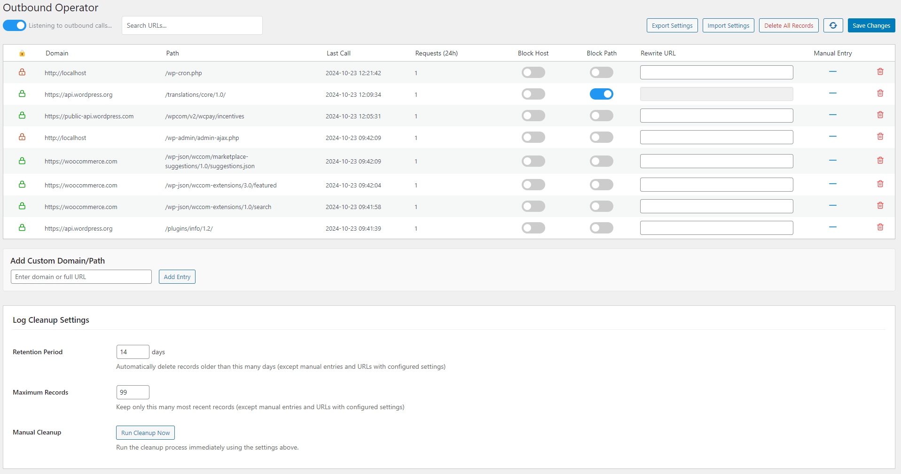

# Outbound Operator

A plugin that logs, blocks and rewrites outbound HTTP requests from your WordPress site. Updates for this specific plugin are served from this Github repo and not wordpress.org.

## Features

- 🔍 **Real-time Monitoring**: Logs all outbound HTTP/HTTPS calls using pre_http_request
- 🚫 **Request Control**: Block requests at either host or path level
- 🔄 **URL Rewriting**: Redirect outbound requests to different URLs
- 🧹 **Automatic Cleanup**: Configurable retention settings to prevent database bloat
- ⚙️ **Import/Export**: Share settings between sites

## Screenshot

## Installation

1. Download the latest release
2. Upload to your WordPress plugins directory (`/wp-content/plugins/outbound-operator/`)
3. Activate the plugin through the 'Plugins' menu in WordPress
4. Access the interface via Tools > Outbound Operator

## Usage

### Basic Monitoring

The plugin starts monitoring outbound calls automatically after activation. You can disable this by flipping the toggle on the top left of the settings page. View all calls under Tools > Outbound Operator.

### Managing Requests

- **Block Hosts**: Block all requests to specific domains
- **Block Paths**: Block specific URL paths
- **URL Rewrites**: Redirect requests to alternative URLs
- **Manual Entries**: Add URLs to monitor before they're called (there is very little validation here, be careful)

### Cleanup Settings

Configure cleanup settings to maintain database performance:
- Set retention period for log entries
- Set maximum number of records to keep
- Manual cleanup option available

### Search and Filter

Use the search box to find specific URLs or domains.

## Updates
Updates for this specific plugin are served from this Github repo and not wordpress.org, though they can be handled in wp-admin like any other plugin.

## Development

Tested on:
- PHP 8.2
- WordPress 6.6.2

## Contributing

Pull requests are welcome. For major changes, please open an issue first to discuss what you would like to change.

## License

[GPL v2 or later](https://www.gnu.org/licenses/gpl-2.0.html)
